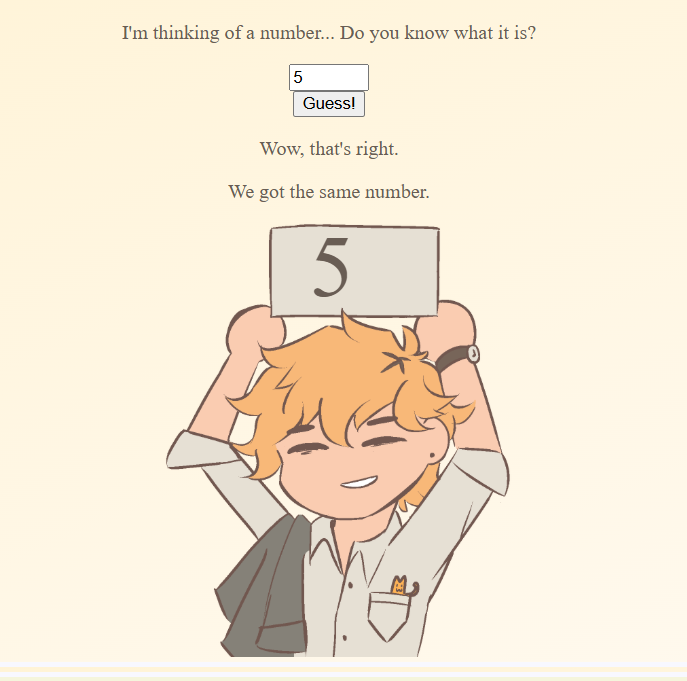
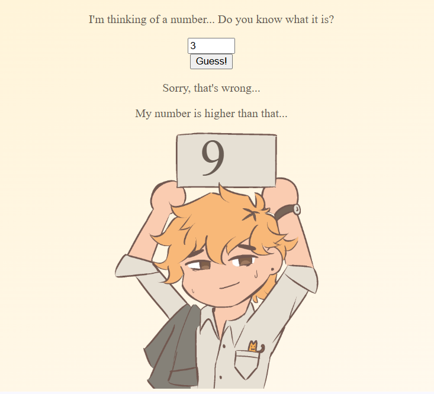
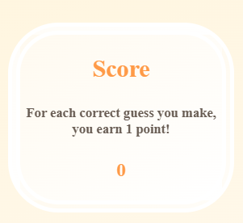
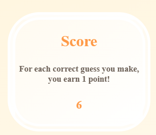

# kaylasimus.github.io

## Guess the Number Game
Game where the player guesses a random number between 1-10.

- The player must pick a number between 1-10 to see if they can pick the same number as the code. Input is taken through a number form.
- Each attempt will generate a different number randomly, the goal is to see how many times the player can guess the same generated number as the code.
  - I unfortunately couldn't figure out how to allow the player to keep guessing until the right number is guessed in one loop, so each loop generates a different number.
    
- The generated number is displayed, which changes each time the button is pressed.
- The image also changes depending on if the user guesses the right or wrong number.
- Output displays feedback for the guess, if it is higher or lower than the generated number.
  
 

- There is a score tracker to keep track of how many times the user was able to guess the correct number.
 

